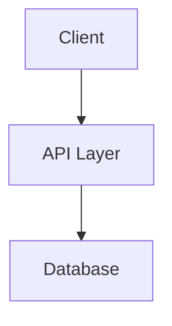

# IMPROVEMENTS.md - Gigaspec Enhancement Proposals

> **Project**: Gigaspec Framework  
> **Last Updated**: 2026-02-18  

This document tracks potential improvements to the gigaspec framework, organized by category and priority.

---

## 🚀 High Priority

### 1. AI Provider Integration
**Status**: 📝 Proposed  
**Effort**: Medium  
**Impact**: High

Integrate directly with AI providers for automated analysis:

```bash
# New commands
gigaspec analyze "My idea" --ai openai
gigaspec analyze "My idea" --ai anthropic --depth deep
gigaspec recommend --based-on requirements.md
```

**Benefits:**
- No manual prompt copy-paste
- Consistent analysis quality
- Follow-up question automation

**Implementation:**
- Add `lib/ai-providers.js` abstraction
- Support OpenAI, Anthropic, local models
- Add `AI_API_KEY` to environment

---

### 2. Project Configuration File
**Status**: 📝 Proposed  
**Effort**: Low  
**Impact**: Medium

Support `.gigaspec.json` for project-level defaults:

```json
{
  "project": {
    "name": "MyProject",
    "stack": "Node.js/Express"
  },
  "templates": {
    "custom": ["./my-templates"]
  },
  "ai": {
    "provider": "openai",
    "model": "gpt-4"
  }
}
```

**Benefits:**
- Consistent team setup
- Skip repetitive flags
- Version control settings

---

### 3. Template Validation
**Status**: 📝 Proposed  
**Effort**: Low  
**Impact**: Medium

Add JSON Schema validation for templates:

```javascript
// lib/template-validator.js
const templateSchema = z.object({
  name: z.string(),
  render: z.function(),
  requiredConfig: z.array(z.string())
});
```

**Benefits:**
- Catch template errors early
- Better IDE support
- Safer community templates

---

## ⚡ Medium Priority

### 4. Visual Diagram Generation
**Status**: 📝 Proposed  
**Effort**: Medium  
**Impact**: High

Generate Mermaid diagrams from specs:

```bash
gigaspec visualize --type architecture
gigaspec visualize --type timeline
gigaspec export --format png
```

**Output:**
```markdown
## Architecture Diagram


```

---

### 5. Template Registry
**Status**: 📝 Proposed  
**Effort**: Medium  
**Impact**: Medium

Community template marketplace:

```bash
# List available templates
gigaspec template list
gigaspec template search "mobile"

# Install custom template
gigaspec template install gigaspec/template-react-native

# Use custom template
gigaspec init --template react-native
```

---

### 6. Specification Diff
**Status**: 📝 Proposed  
**Effort**: Medium  
**Impact**: Medium

Track changes between spec versions:

```bash
# Compare current spec to git HEAD
gigaspec diff

# Compare two specs
gigaspec diff v1.0.0 v2.0.0

# Generate changelog
gigaspec changelog --since v1.0.0
```

---

### 7. Enhanced MCP Tools
**Status**: 📝 Proposed  
**Effort**: Low  
**Impact**: Medium

Add more granular MCP tools:

```javascript
// New tools
gigaspec-template-list    // List available templates
gigaspec-template-render  // Render specific template
gigaspec-validate         // Validate spec files
gigaspec-migrate          // Migrate spec to new version
```

---

## 🔮 Future Ideas

### 8. Real-time Collaboration
Multi-user editing of specifications with conflict resolution.

### 9. IDE Extensions
VS Code/Cursor extension for gigaspec integration.

### 10. Web Dashboard
Web UI for managing specifications visually.

### 11. AI Code Generation
Generate actual code from specifications:

```bash
gigaspec generate-code --from STATE.md --output ./src
```

### 12. Specification Testing
Validate implementation against specification:

```bash
gigaspec verify --spec PLAN.md --code ./src
```

---

## 📊 Priority Matrix

| Feature | Effort | Impact | Priority |
|---------|--------|--------|----------|
| AI Provider Integration | M | H | P0 |
| Project Config File | L | M | P1 |
| Template Validation | L | M | P1 |
| Visual Diagrams | M | H | P1 |
| Template Registry | M | M | P2 |
| Spec Diff | M | M | P2 |
| Enhanced MCP Tools | L | M | P2 |
| Real-time Collab | H | M | P3 |
| IDE Extensions | H | M | P3 |
| Web Dashboard | H | L | P4 |
| AI Code Generation | H | H | P4 |
| Spec Testing | H | H | P4 |

---

## 🏷️ Legend

- **P0**: Critical - Do first
- **P1**: High - Do soon
- **P2**: Medium - Nice to have
- **P3**: Low - Future consideration
- **P4**: Dream - Major effort
